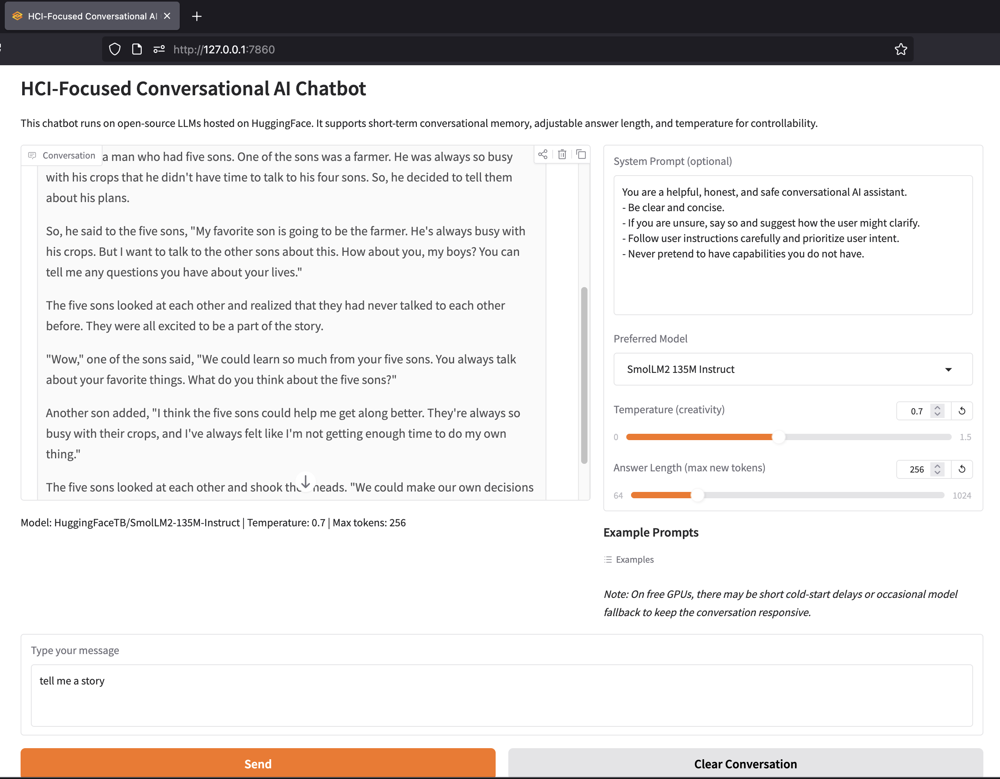

# HCI-Focused Conversational AI Chatbot

This project is a conversational AI chatbot designed for Human-Computer Interaction (HCI) studies. It supports multiple open-source Large Language Models (LLMs) like Llama 3, Mistral, and Gemma, featuring short-term memory, adjustable parameters, and a fallback mechanism for robust loading.



## Features

- **Multi-Model Support**: Switch between Llama 3, Mistral, Gemma 2, and smaller models like SmolLM2.
- **Robust Fallback**: Automatically switches to smaller models if the preferred one fails to load (e.g., due to memory constraints).
- **Interactive UI**: Built with Gradio for a user-friendly chat interface.
- **Configurable**: Adjust temperature, max tokens, and system prompts.
- **Logging**: Saves conversation history and user feedback for analysis.

## Prerequisites

- **Hugging Face Account**: You need an account to access gated models (like Llama 3 and Gemma).
- **Access Token**: Create a [User Access Token](https://huggingface.co/settings/tokens) with `read` permissions.
- **Model Access**: Visit the model pages on Hugging Face (e.g., `meta-llama/Meta-Llama-3-8B-Instruct`) and accept their license terms.

## Setup & Installation

### 1. Configure Environment

Create a `.env` file in the root directory and add your Hugging Face token:

```bash
HF_TOKEN=hf_your_token_here
```

### Option A: Run with Docker (Recommended)

This method handles all dependencies and ensures a consistent environment.

#### Prerequisites for GPU Support
To use your NVIDIA GPU with Docker, you must have the **NVIDIA Container Toolkit** installed.
1.  Install NVIDIA Drivers for your GPU.
2.  Install the [NVIDIA Container Toolkit](https://docs.nvidia.com/datacenter/cloud-native/container-toolkit/latest/install-guide.html).
3.  Restart the Docker daemon.

#### Build and Run

1.  **Build and Run**:
    ```bash
    docker-compose up --build
    ```
    *Note: The `docker-compose.yml` is configured to use all available NVIDIA GPUs. If you don't have a GPU or the toolkit installed, Docker might ignore the GPU request or you may need to comment out the `deploy` section in `docker-compose.yml`.*

2.  **Access the App**:
    Open your browser and go to: [http://localhost:7860](http://localhost:7860)

    *Note: The first run may take some time as it downloads the models. These are cached locally in `~/.cache/huggingface` so subsequent runs are faster.*

### Option B: Run Locally (Python)

**Recommended for macOS Users with Apple Silicon (M1/M2/M3)**
*Docker on macOS does not currently support GPU acceleration (Metal/MPS) for this application. To utilize your Mac's GPU, please follow these steps to run the application locally.*

1.  **Create a Virtual Environment**:
    ```bash
    python -m venv .venv
    source .venv/bin/activate  # On Windows: .venv\Scripts\activate
    ```

2.  **Install Dependencies**:
    ```bash
    pip install -r requirements.txt
    pip install protobuf  # Required for some models
    ```

3.  **Login to Hugging Face**:
    ```bash
    huggingface-cli login
    # Paste your token when prompted
    ```

4.  **Run the App**:
    ```bash
    python app.py
    ```

5.  **Access the App**:
    Open your browser and go to: [http://127.0.0.1:7860](http://127.0.0.1:7860)

## Remote Inference Version

If you don't have a powerful GPU, you can use the remote inference version which runs models on Hugging Face's servers (free tier).

```bash
python app_remote.py
```

## Troubleshooting

-   **401 Client Error**: This usually means you haven't accepted the model license on Hugging Face or your token is invalid. Check the model page (e.g., `google/gemma-2-9b-it`) and ensure you have access.
-   **OOM (Out of Memory)**: If a model is too large for your computer, the app will automatically try to load a smaller one from the fallback list.
